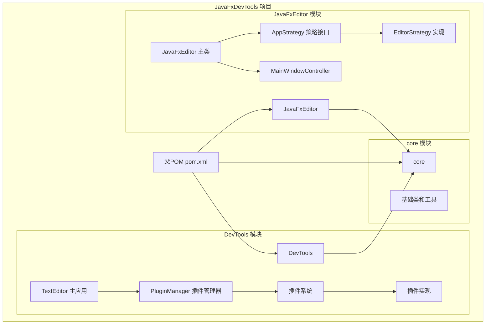
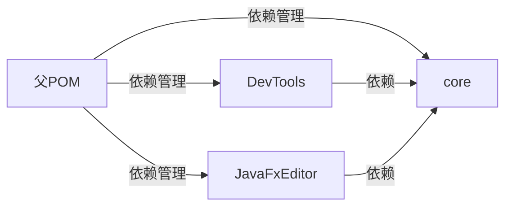
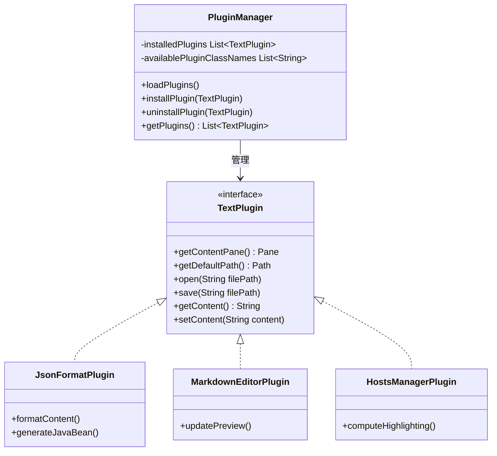
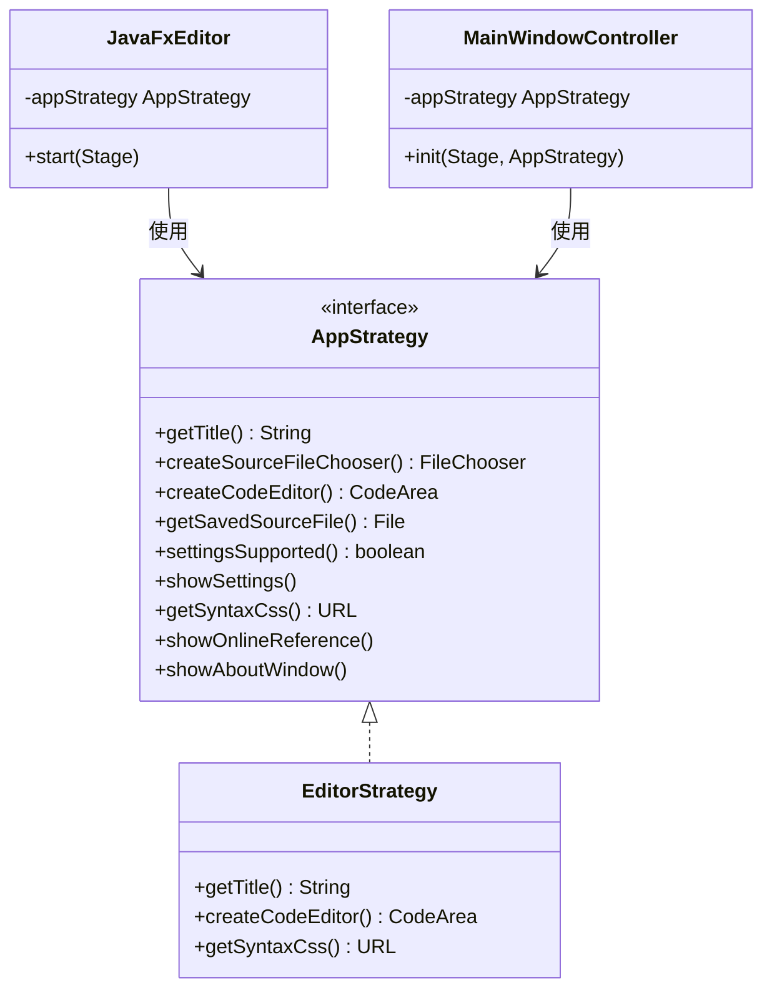
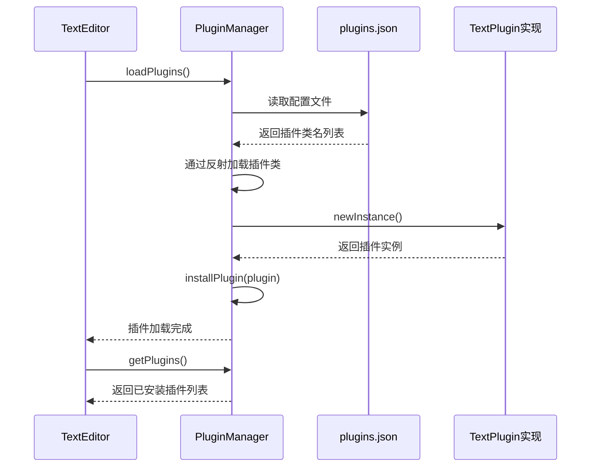
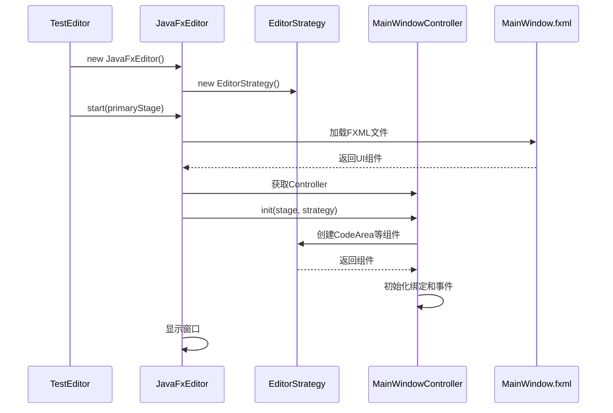
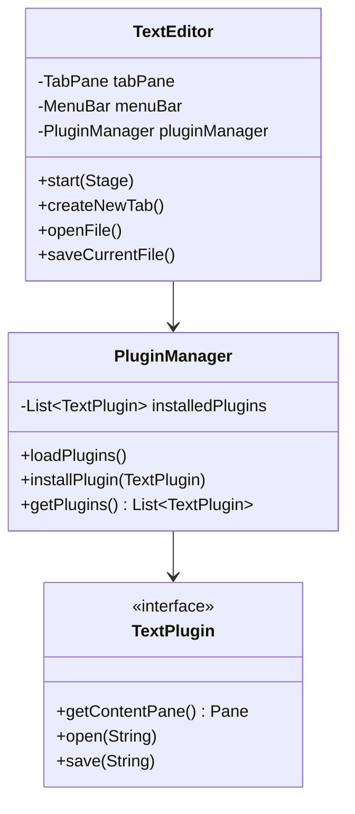
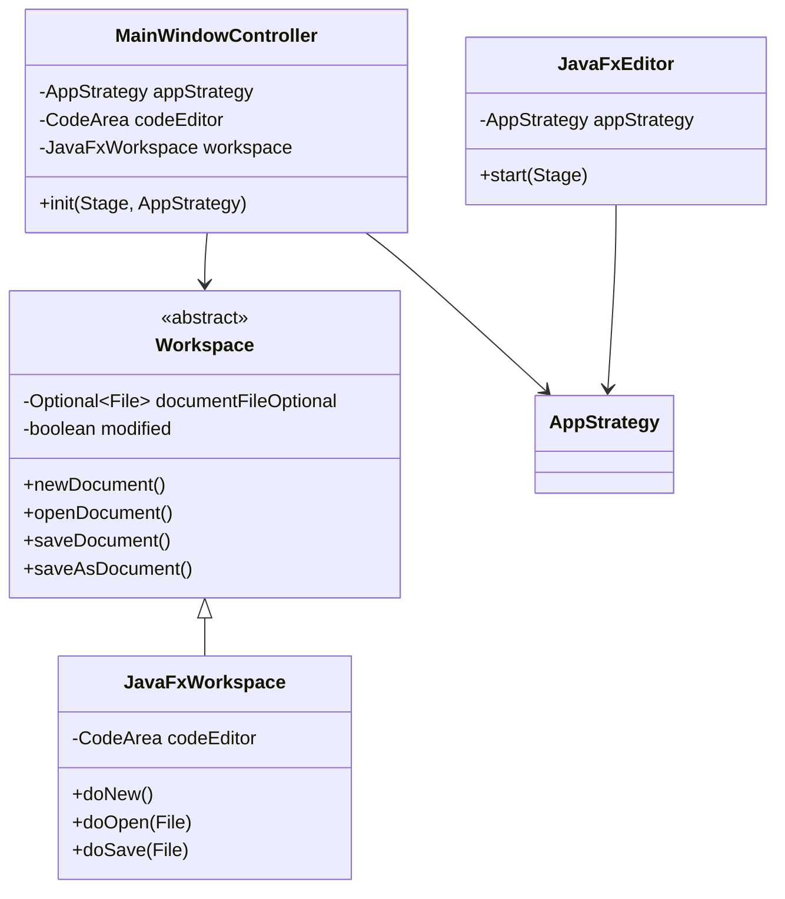

# 架构设计文档

## 系统整体架构

JavaFxDevTools 采用多模块 Maven 项目结构，使用插件化架构和策略模式实现高度可扩展的桌面应用程序。

## 模块依赖关系

## 核心设计模式

### 1. 插件模式（Plugin Pattern）

DevTools 模块采用插件模式，通过 `TextPlugin` 接口定义插件规范，`PluginManager` 负责插件的加载和管理。

### 2. 策略模式（Strategy Pattern）

JavaFxEditor 模块使用策略模式，通过 `AppStrategy` 接口定义可定制的编辑器行为。

## 数据流图

### DevTools 插件加载流程

### JavaFxEditor 启动流程

## 关键类图

### DevTools 核心类

### JavaFxEditor 核心类

## 模块职责

### core 模块

- 提供基础的 JavaFX 组件
- 共享的工具类和工具方法
- 通用的 FXML 资源

### DevTools 模块

- **TextEditor**: 主应用程序类，管理窗口和菜单
- **PluginManager**: 插件管理器，负责插件的加载、安装、卸载
- **TextPlugin**: 插件接口，定义插件必须实现的方法
- **插件实现**: JsonFormatPlugin、MarkdownEditorPlugin、HostsManagerPlugin 等

### JavaFxEditor 模块

- **JavaFxEditor**: 编辑器主类，负责初始化窗口
- **AppStrategy**: 策略接口，定义可定制的编辑器行为
- **EditorStrategy**: 策略实现，提供默认的编辑器行为
- **MainWindowController**: 主窗口控制器，处理用户交互
- **Workspace**: 抽象工作空间类，管理文档状态
- **JavaFxWorkspace**: Workspace 的具体实现

## 扩展点

### 添加新插件

1. 实现 `TextPlugin` 接口
2. 在 `plugins.json` 中注册插件类名
3. 插件会在应用启动时自动加载

### 定制编辑器行为

1. 实现 `AppStrategy` 接口
2. 在创建 `JavaFxEditor` 时传入自定义策略
3. 编辑器将使用自定义策略的行为

## 技术选型说明

### JavaFX 17.0.6

- 现代化的 Java 桌面应用框架
- 丰富的 UI 组件库
- 良好的跨平台支持

### RichTextFX

- 高性能的代码编辑器组件
- 支持语法高亮
- 支持撤销/重做功能

### Jackson

- 高性能的 JSON 处理库
- 支持 JSON 解析、生成、格式化

### CommonMark

- 标准的 Markdown 解析器
- 支持将 Markdown 转换为 HTML

## 性能考虑

1. **插件懒加载**: 插件在需要时才创建实例
2. **异步语法高亮**: HostsManagerPlugin 使用异步任务进行语法高亮，避免阻塞 UI
3. **虚拟化滚动**: 使用 VirtualizedScrollPane 优化大文件显示性能

## 安全性

1. **文件操作**: 所有文件操作都进行异常处理
2. **插件隔离**: 插件通过接口隔离，无法直接访问系统资源
3. **输入验证**: JSON 格式化插件包含输入验证和错误提示

